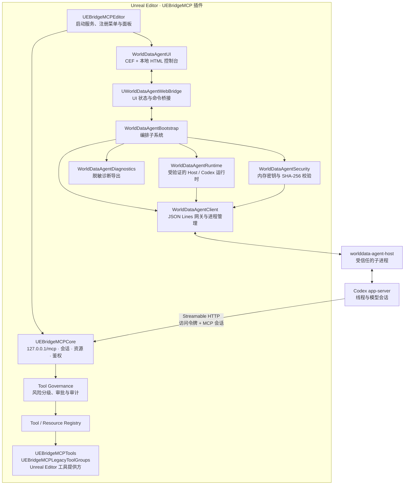

# UEBridgeMCP

**UEBridgeMCP** 是一个运行在 Unreal Editor 内的 MCP（Model Context Protocol）桥接插件。它把编辑器能力以受控、可审计的 MCP 工具与资源暴露给 Codex，同时在 Unreal 中提供一个嵌入式对话控制台，用于创建、恢复和继续 Codex 会话。

项目的目标不是让模型直接拥有编辑器权限，而是在“模型意图”和“编辑器变更”之间建立一条可验证、可审批、可追踪的本地链路。插件当前定位为 Windows 上的 Unreal Editor Beta 集成。

## 设计思路

### 1. 编辑器优先的本地闭环

MCP 服务运行在编辑器进程中，并只监听本机回环地址。Codex 通过本地 `worlddata-agent-host` 连接服务；所有工具最终仍由 Unreal 的模块和编辑器 API 执行。这样，项目上下文、世界状态和变更操作都留在本机 Unreal 会话内。

### 2. 分层而不是“一个大插件模块”

UI、会话协议、运行时安装、凭据、MCP 服务器和具体工具被拆分为独立模块，并通过小而稳定的接口协作。上层不直接依赖底层实现：例如 UI 只面对 `IWorldDataAgentGateway`，工具提供方只向注册表注册能力，MCP 核心统一负责协议、鉴权、审批和审计。

### 3. 默认安全、最小暴露

服务端使用 `127.0.0.1` 和一次性访问令牌；令牌保存在进程内，仅在启动受信任的 Agent Host 时短暂注入环境变量。运行时二进制以 SHA-256 内容地址保存，并由清单验证。对会改变编辑器状态的工具，服务端默认要求交互审批，并写入不包含参数值的脱敏 JSONL 审计记录。

### 4. 面向异步会话与编辑器线程

Agent Host 用 JSON Lines 与插件通信，负责把 Codex app-server 的事件转换为线程、消息增量、工具状态和审批请求。插件将这些事件切回 Unreal 游戏线程；需要触及编辑器状态的 MCP 调用也在受控的编辑器上下文中执行，从而避免 UI、进程 I/O 和编辑器 API 互相阻塞。

## 总体架构



这张图体现了两条独立但互补的通路：**会话通路**将 Unreal 面板连接到 Codex；**工具通路**将 Codex 连接到编辑器内的 MCP 服务。二者在本地 MCP 端点相会，但权限判断始终在服务器端完成。

## 一次完整请求如何流转

1. `UEBridgeMCPEditor` 启动时先加载工具模块，再启动 MCP 服务，确保客户端看到 `tools/list` 时注册表已完整。
2. `WorldDataAgentBootstrap` 加载并校验运行时清单；首次配置时，`WorldDataAgentRuntime` 将 Agent Host、已安装的 Codex 和协议 schema 放入内容地址目录，再生成带哈希的清单。
3. `WorldDataAgentClient` 从 `WorldDataAgentSecurity` 获取一次性 MCP 令牌，启动 Agent Host，并通过 JSON Lines 发送连接、建会话、恢复会话和发送消息等命令。
4. Agent Host 连接 Codex app-server；Codex 依据由插件生成的本地配置，使用带令牌的 HTTP 会话访问 `http://127.0.0.1:<port>/mcp`。
5. MCP 核心校验令牌、会话和请求大小，分发资源或工具调用。工具调用经过风险策略：只读操作直接执行，变更操作默认进入 Unreal 内的非模态审批队列；完成结果写入脱敏审计日志。
6. 会话消息、工具状态和审批事件沿 Agent Client → Web Bridge 返回 CEF 面板，用户可在 Unreal 内继续对话或批准/拒绝操作。

## 模块职责

| 模块 | 职责 |
| --- | --- |
| `WorldDataAgentContracts` | 跨模块的数据类型和接口：连接状态、线程、会话事件、运行时、凭据与诊断。 |
| `WorldDataAgentSecurity` | 进程内短生命周期密钥、受信任子进程取用、Windows SHA-256 校验。 |
| `WorldDataAgentDiagnostics` | 收集诊断事件并导出脱敏信息。 |
| `WorldDataAgentRuntime` | 发现、复制、哈希校验并清单化 Agent Host、Codex 与 app-server schema。 |
| `WorldDataAgentClient` | 管理 Agent Host 子进程，处理 JSON Lines 协议，将 Codex 事件转为 Unreal 事件。 |
| `WorldDataAgentBootstrap` | 将安全、诊断、运行时和网关组装为统一子系统。 |
| `UEBridgeMCPCore` | 本地 MCP HTTP 服务、令牌/会话管理、资源与工具注册、客户端配置写入。 |
| `UEBridgeMCPTools` | 核心、较轻量的 Unreal 编辑器工具提供方。 |
| `UEBridgeMCPLegacyToolGroups` | 将宽泛的编辑器 API 工具组隔离为兼容层，避免核心模块膨胀。 |
| `WorldDataAgentUI` | CEF 面板、HTML 资源和 Unreal ↔ JavaScript 的对象桥。 |
| `UEBridgeMCPEditor` | 插件入口：启动 MCP、初始化会话子系统并注册编辑器菜单/面板。 |

## 安全与治理边界

- **仅本机监听**：MCP 地址固定为 `127.0.0.1`，不会暴露到局域网。
- **令牌校验**：`/mcp` 需要 `X-WorldData-MCP-Token`，同时要求 MCP 会话头。
- **短生命周期密钥**：令牌不会写入普通项目配置；插件关闭时会撤销内存句柄。
- **可验证运行时**：Agent Host、Codex 与 schema 由运行时清单记录 SHA-256；每次加载均重新验证。
- **服务器端审批**：审批逻辑位于 MCP 核心，不依赖客户端是否遵守工具注解。未知工具按高风险失败关闭。
- **脱敏审计**：记录调用标识、工具、风险、耗时和参数形状，不保存参数值或可承载密钥的内容。

## 目录结构

```text
UEBridgeMCP.uplugin
Resources/
  Web/                         # CEF 面板使用的 HTML、CSS、JavaScript
Source/
  WorldDataAgentContracts/     # 接口与共享类型
  WorldDataAgentSecurity/      # 密钥与哈希校验
  WorldDataAgentDiagnostics/   # 诊断与脱敏导出
  WorldDataAgentRuntime/       # 运行时安装与清单验证
  WorldDataAgentClient/        # Agent Host JSON Lines 网关
  WorldDataAgentBootstrap/     # 子系统编排
  UEBridgeMCPCore/             # MCP 服务、注册表、审批与审计
  UEBridgeMCPTools/            # 核心编辑器工具
  UEBridgeMCPLegacyToolGroups/ # 大范围编辑器工具兼容层
  WorldDataAgentUI/            # CEF 面板与 Web Bridge
  UEBridgeMCPEditor/           # 编辑器入口与菜单
```

## 使用范围

该插件面向 Unreal Editor 自动化与项目内协作。它需要本机可用的 Codex 安装以及已构建的 `worlddata-agent-host`；首次运行时可从插件面板配置并验证受管运行时。由于工具可能改变场景、资产或项目设置，建议始终在版本控制下使用，并保留变更审批与审计的默认设置。
